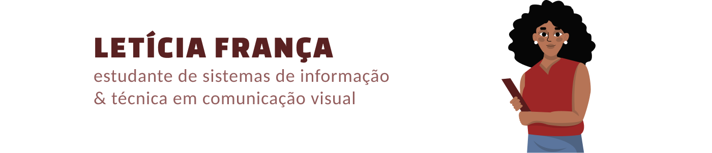

## Olá, eu sou a Letícia 👋🏾 👩🏾‍💻

  

<p1> Estudo Sistemas de Informação e venho de uma formação técnica em Comunicação Visual. Tenho curiosidade em saber sobre como as pessoas se relacionam com a tecnologia, gosto de observar, entender o que funciona e pensar em jeitos de tornar a experiência mais simples e intuitiva.

Me interesso muito pela parte do design, usabilidade, e tudo que envolve pensar em quem está do outro lado usando o produto. Gosto de unir o lado criativo com a lógica, entender o porquê das coisas e buscar soluções que façam sentido de verdade.
</p1>

## Conheça um pouco do meu trabalho 🌐:
📌 Meu portfólio visual: [Behance](https://www.behance.net/letciafrana6)  
📌 Conheça mais sobre mim: [LinkedIn](https://www.linkedin.com/in/leticiafranca3008)

